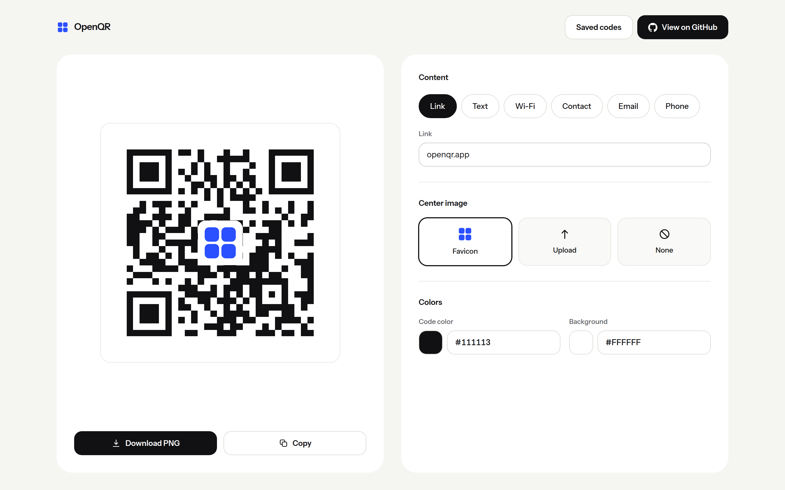
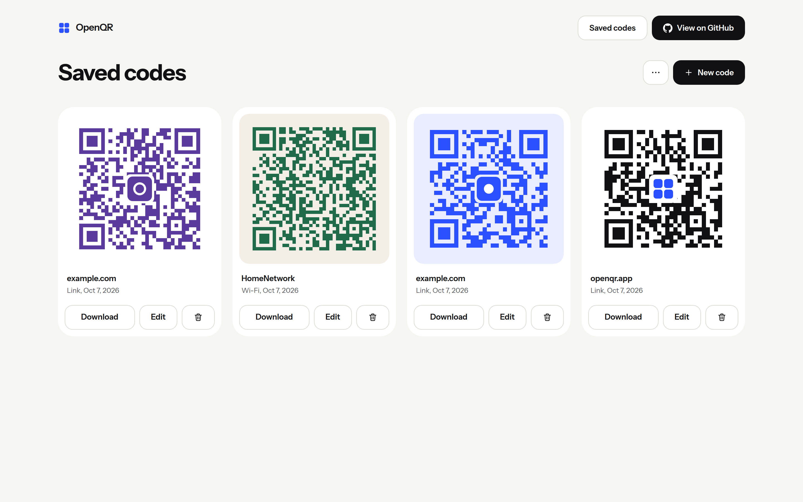
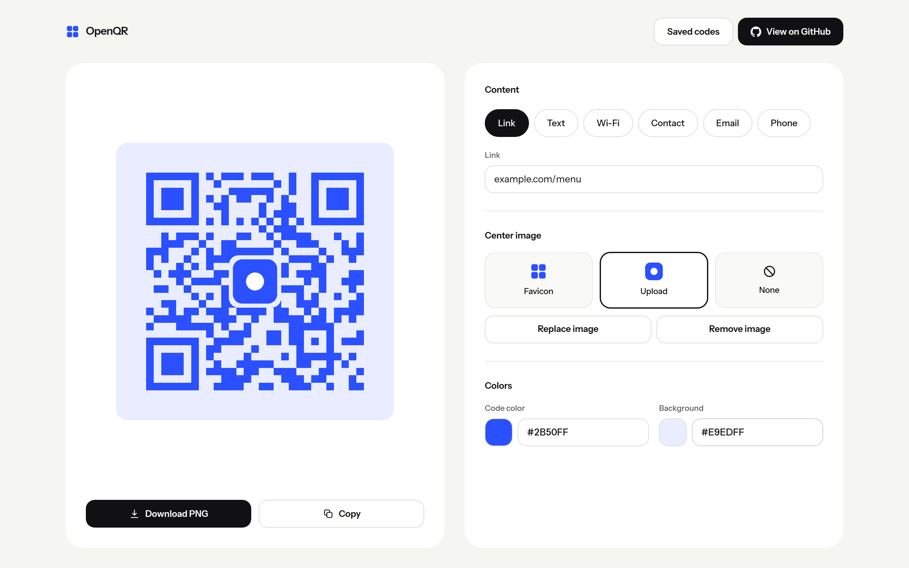
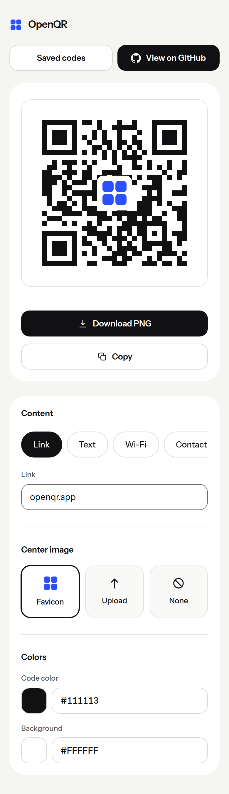

<p align="center">
  
</p>

<h1 align="center">OpenQR</h1>

<p align="center">
  A free, no-account QR code generator with your own image in the middle.
  <br>
  <a href="https://openqrgen.vercel.app">openqrgen.vercel.app</a>
</p>

<p align="center">
  
  
  
</p>

## What it is

OpenQR makes a clean QR code and puts your logo in the middle. Paste a link and the code appears. The site's own favicon lands in the center. Or upload an image, or leave the center empty.

Codes are static. The content is encoded straight into the pattern, with no redirect service and no tracking, so a code can never expire. There are no accounts. Past codes are saved in your browser.

You make three decisions on screen: what the code says, what goes in the middle, and the colors.



<table>
  <tr>
    <td width="50%"></td>
    <td width="50%"></td>
  </tr>
  <tr>
    <td align="center">Saved codes, kept in your browser</td>
    <td align="center">Your own colors and image</td>
  </tr>
  <tr>
    <td colspan="2" align="center"></td>
  </tr>
</table>

## Features

Six content types: Link, Text, Wi-Fi, Contact (vCard 3.0), Email and Phone.

Three center options: the link's favicon, an uploaded image, or none.

Any code color and any background color, with a warning when the pair may not scan.

Download a 1024 px PNG, or copy the image to the clipboard where the browser allows it.

Every valid code is saved automatically. The Saved codes page lets you download, edit and delete them, with a five second undo. A small menu exports and imports a JSON backup so codes can move between browsers.

Safety limits are built in rather than offered as options. A code that looks good but does not scan is a bug.

## How it works

The form state is one reducer. Everything else is derived from it on each render and never stored.

1. The form values become a payload string (`lib/qr/encode.ts`).
2. `qrcode` returns the module matrix at error correction level H, the highest one (`lib/qr/matrix.ts`).
3. Our own geometry code merges dark modules into a single SVG path, adds a four module quiet zone, and places a rounded plate and the logo in the center (`lib/qr/geometry.ts`).
4. The preview draws that geometry as inline SVG. The PNG export draws the same geometry on a canvas at 1024 px, so what you see is what you download.

### Center image rules

The plate is 24% of the code width (about 6% of the area), with a small padding, and is painted in the background color so the logo never touches a module. It never grows past 26%. Above 300 characters the plate shrinks to 20% and a gentle warning appears. Above 1,000 characters the image is turned off. The hard limit is about 1,270 bytes, the level H capacity.

### Favicons

When the link field settles (600 ms), the browser calls `GET /api/favicon?host=<hostname>`. Only the hostname is sent. The server reads the homepage, collects icon links, tries the largest first and falls back to `/favicon.ico`. It converts whatever it finds to a 256 px PNG with sharp, so the browser never receives SVG or other formats from third party sites. The icon is stored inside the saved code, so old codes still render if the site changes its icon.

The route is the only attack surface, so it is strict:

- Only public hostnames. IP literals, `localhost` and internal looking suffixes are refused.
- The DNS answer is checked when the connection is made, which stops names that resolve to private addresses (including DNS rebinding).
- Every redirect is checked again. At most 3 redirects, a 4 second timeout, 512 KB for HTML and 1 MB for images.
- The content type is checked before the body is read.
- SVGs with embedded images, scripts or outside links are refused before they reach the rasterizer.
- A small in-memory rate limit backs up the real one, which should be a Vercel Firewall rule.

### Privacy

QR content stays in the browser. The server sees a hostname when you look up a favicon, and does not log it. No accounts, no cookies, no analytics, no third party scripts. The Content Security Policy is `default-src 'self'` with images from `self`, `data:` and `blob:`. Uploaded images are drawn through an `img` element onto a canvas, never inserted into the page.

### Storage

Saved codes live in IndexedDB through `idb-keyval`: one store for records and one for image blobs. A record keeps the raw form values, so Edit restores the form exactly. Delete shows an Undo toast for five seconds before the image is purged. The app asks the browser for persistent storage so codes are less likely to be evicted.

## Tech stack

Next.js (App Router) and TypeScript, Tailwind CSS 4, Instrument Sans through `next/font`, `qrcode`, `idb-keyval`, `sharp` on the server. Tests use Vitest, Playwright, `jsqr` and axe.

## Project structure

```
app/                  routes: generator, saved codes, /api/favicon
components/
  center/             favicon, upload and none tiles
  colors/             color pickers with hex fields
  content/            type pills and schema driven fields
  export/             download and copy
  generator/          the two card screen
  layout/             header
  qr/                 SVG renderer, preview, placeholder
  saved/              saved cards, backup menu
  ui/                 buttons, inputs, toast, tooltip, menu, icons
hooks/                favicon lookup, autosave, edit loading, saved list
lib/
  color/              hex parsing and contrast
  export/             file names and downloads
  favicon/            client cache, discovery, SSRF guards, ICO reader, conversion
  generator/          state, reducer, derived values, record mapping
  image/              upload processing and data URLs
  qr/                 payloads, matrix, geometry, SVG and PNG renderers
  storage/            IndexedDB, records, backup and validation
tests/                unit tests, and e2e/ for Playwright
assets/               brand logo and README screenshots
```

## Getting started

You need Node 20 or newer (`.nvmrc` pins 22).

```bash
npm install
npm run dev
```

Open http://localhost:3000.

### Scripts

- `npm run dev`: start the dev server
- `npm run build`: production build
- `npm start`: serve the production build
- `npm run lint`: ESLint
- `npm run typecheck`: TypeScript, no emit
- `npm test`: unit tests (Vitest)
- `npm run test:e2e`: Playwright flows against a production build
- `npm run screenshots`: retake the README screenshots from a running app

### Tests

The unit tests cover every payload builder, color and contrast checks, the geometry rules, the favicon guards and backup validation. The scan tests rasterize the SVG output and decode it with `jsqr`, for every content type with and without a center image, and compare the result to the payload. The Playwright tests cover the main flows on a desktop and a phone viewport, check that no third party request is made, and run axe for WCAG A and AA violations.

If Playwright cannot find its browser, point it at any Chromium with `PLAYWRIGHT_CHROMIUM_PATH`.

### Deploying

The app deploys to Vercel as is: static pages on the CDN and one Node function for the favicon route. Add a Vercel Firewall rate limit rule for `/api/favicon`.

## License

MIT. See [LICENSE](LICENSE).
